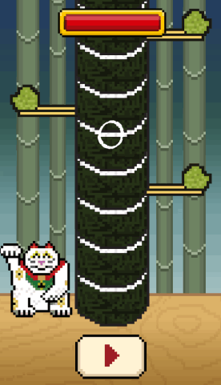

In this tutorial you will build Sushi Neko -- a clone of the popular mobile game [Timberman](https://itunes.apple.com/us/app/timberman/id871809581?mt=8). You will use Apple's Swift programming language together with SpriteKit their game development framework.

#What you will learn

Throughout this tutorial you will learn many concepts including how to:

- Effectively use SpriteKit to rapidly prototype a game
- Build an 'endless' core mechanic
- Use property observers in Swift
- Add effective animations
- Add simple visual effects
- Implement game state management

#The finished product

Time to get started with a new SpriteKit project!

#Feedback

If you have feedback on this tutorial or find any mistakes, please open issues on the [GitHub Repository](https://github.com/MakeSchool-Tutorials/Sushi-Neko-SpriteKit-Swift).
