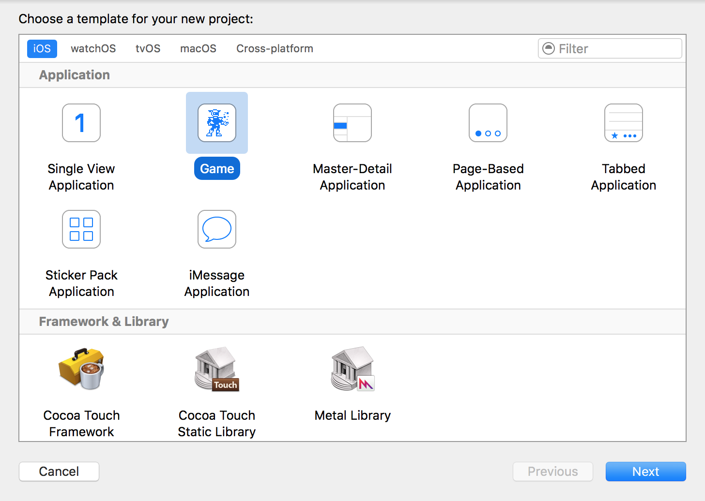
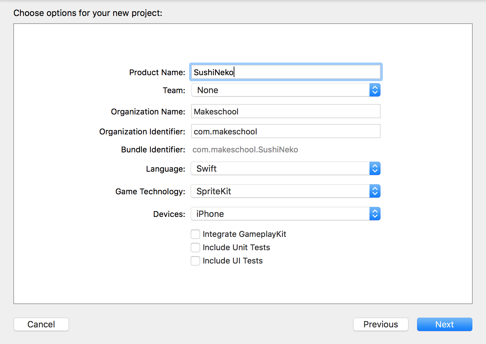

> [action]
> Create a new *Game* project in Xcode named `SushiNeko` and check that the *Language* is set to `Swift` and
> *Game Technology* is set to `SpriteKit`. Choose a location for the project and finish the process.
> 
>
> 

## Importing Resources

> [action]
> Download the [Sushi Neko Art Pack](https://github.com/MakeSchool-Tutorials/Sushi-Neko-SpriteKit-Swift4/raw/master/assets.atlas.zip)
> we created for you.
> Once the download is complete, unpack the folder and add it to your project. Do this by dragging the folder *assets.atlas* to the Xcode navigator (the left pane where you can see all the files). Doing this will show a window asking if you want to copy the files.
> Ensure you have *Copy items if needed* and *Create groups*.
> 
>

<!-- -->

> [action]
> Download the [SFX Starter Kit](https://github.com/MakeSchool-Tutorials/Sushi-Neko-SpriteKit-Swift3/raw/master/SFX.zip)
> we made for you. Once the download is complete, unpack the folder and add to the project.
> Ensure you have *Copy items if needed* and *Create groups*.
> 
>

## Adding extra functionality

SpriteKit is missing some useful functionality, thankfully we have bundled some together for you. Create a new file: File -> new -> file

Select the option *Swift file* and name it *MSButtonNode*. Its location should be inside the SuhiNeko folder.

> [action]
> Download *[MSButtonNode.swift](https://github.com/MakeSchool-Tutorials/Sushi-Neko-SpriteKit-Swift3/raw/master/MSButtonNode.swift)* and copy the contents into the file you just created.

# Building the project

Great, you now have everything in place to get started building your game. Before we move on though, lets build our project to make sure that everything is working okay. First select a simulator to replace the option *Generic iOS device* (top section of Xcode). The quickest way to do this is to use the shortcut `CMD+B` to build our project. We don't want to run our project yet because we would just have a blank screen. We do want to build the project though so that the compiler can help tell us if anything is broken. If you have a clean build with no errors you should be all set! If you encounter an error at this point ask for help to your instructor or TA.
