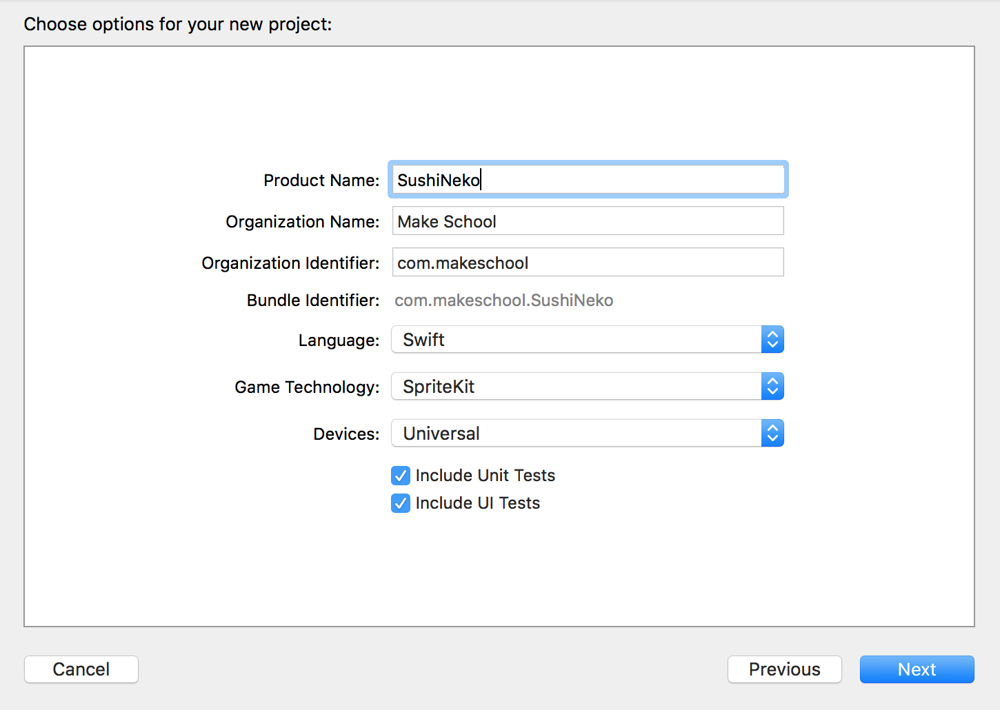
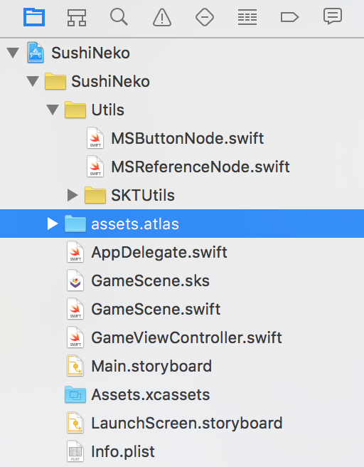

#Create a new SpriteKit project

> [action]
> Create a new *Game* project in Xcode named `SushiNeko` and check the *Language* is set to `Swift` and *Game Technology* is set to `SpriteKit`.
> 
>

##Importing Resources

> [action]
> Download the [Sushi Neko Art Pack](../assets.atlas.zip) we created for you.
> Once the download is complete, unpack the folder and add it to your project.
> Ensure you have *Copy items if needed* and *Create groups*.
> 
>

##Adding extra functionality

SpriteKit is missing some useful functionality, thankfully we have bundled some together for you.  

> [action]
> Download the [MakeSchool Utilities](../Utils.zip), unpack the folder and add it to your project as you
did with the art pack.
>

Your project structure should hopefully look similar to this:

#Summary

Great, you now have everything in place to get started building your game.
