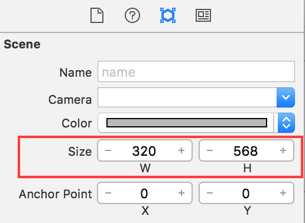
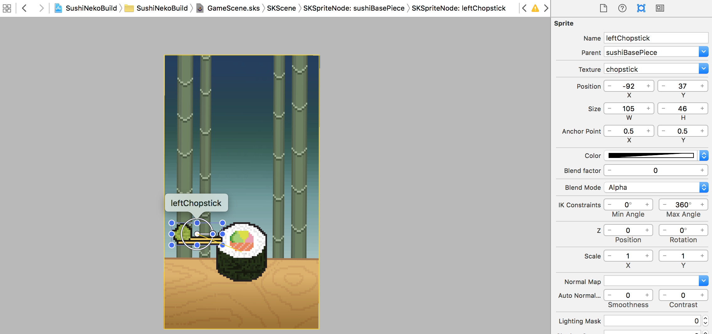
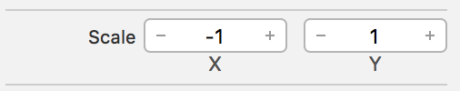
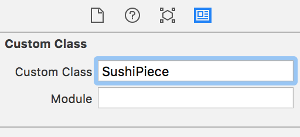
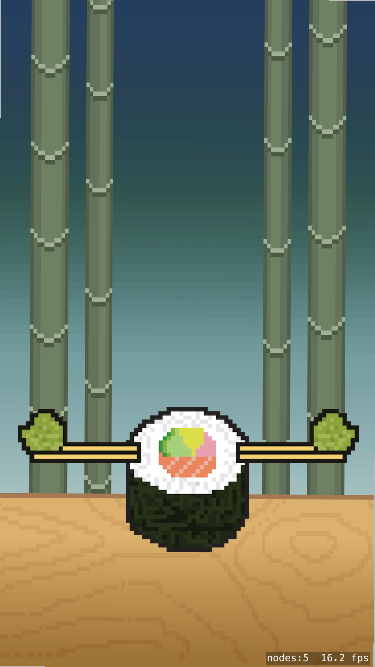
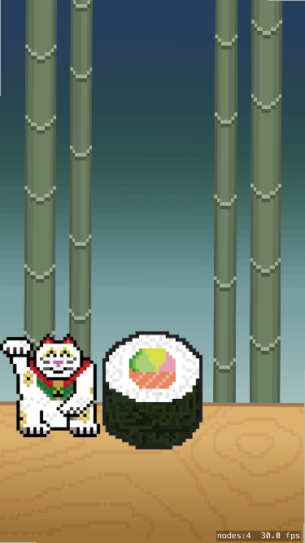

#Set the scene

For Sushi Neko you will be using the default portrait orientation. You will need to modify the *GameScene.sks* scene size to a retina iPhone 5 resolution. It's a good design resolution to work with and the artwork was designed for this resolution, it will still work nicely for iPhone 6 upwards :]

> [action]
> Open *GameScene.sks*, `Zoom Out` until you can see the yellow bounding box of the scene. Click on *Atrributes inspector* and set the *Size* to `(320,568)`
> 
>

##Adding the backdrop

It's nice to work with a backdrop, so let's add this before working on the core objects.

> [action]
> Drag *background.png* onto the scene and snap to the center. Set the *Z Position* to `-1`.
>

#Creating Sushi

Sushi is a key ingredient in our game mechanic, you will use it to build a sushi tower. To create the tower you will be randomly stacking sushi, before you can stack the tower you need to build a core piece of sushi.  This master piece will contain two chopsticks, one on the left and one on the right.  

This will enable 3 possible sushi pieces:

- Sushi with no chopsticks
- Sushi with left hand side chopstick
- Sushi with right hand side chopstick

Let's setup this master sushi piece.

> [action]
> Drag in *roll.png* and place it in the center of the screen near the bottom. I would suggest around `(160,160)`, set the *Name* to `sushiBasePiece`.
> Drag in *chopstick.png* and move it to the top-left side of the *sushiBasePiece*.
> You want this *chopstick* to be part of our **Sushi Piece**, set *Parent* to `sushiBasePiece` and I would suggest a position of around `(-92,37)`.  Set the *Name* to `leftChopstick`
>
> 
>

Now we need to add the right hand side chopstick. Can you do this?

> [solution]
> *Copy / Paste* the left chopstick, set the *Name* to `rightChopstick`.  
There is a simple trick to flip the asset horizontally, set *Scale X* to `-1`.
>
> 
>

##Sushi type

You will want to keep track of the type of sushi piece.
An *Enumeration* would work well for the first job, knowing what *Side* the chopstick is on will come in handy later
when you need to test for cat vs chopstick collisions.

> [action]
> Add the following code to the top of *GameScene.sks* before the class definition.
>
```
/* Tracking enum for use with character and sushi side */
enum Side {
    case Left, Right, None
}
```

Next up you will create a custom sushi class called *SushiPiece*

#The SushiPiece class

> [action]
> Create a new *Swift* file (`File > New > File > Swift File`) and name it `SushiPiece.swift`.
> Replace the contents of this file with:
>
```
import SpriteKit
>
class SushiPiece: SKSpriteNode {
>    
    /* Chopsticks objects */
    var rightChopstick: SKSpriteNode!
    var leftChopstick: SKSpriteNode!
>    
    /* You are required to implement this for your subclass to work */
    override init(texture: SKTexture?, color: UIColor, size: CGSize) {
        super.init(texture: texture, color: color, size: size)
    }
>    
    /* You are required to implement this for your subclass to work */
    required init?(coder aDecoder: NSCoder) {
        super.init(coder: aDecoder)
    }
>    
}
```
>

This gives you a basic subclass of *SKSpriteNode*, with properties ready to connect to the chopsticks.
Before you do this, you need to set the **sushiBasePiece** class to *SushiPiece*, you can do this via the *Custom Class Inspector*.

> [action]
> Open *GameScene.sks*, select the *sushiBasePiece* and set *Custom Class* to `SushiPiece`
>
> 

Run the game, you should expect to see the scene as it is in the editor.



Looking good, time for you to connect the chopsticks.

##Connecting chopsticks

Let's setup a function to handle this.

> [action]
> Add the following method to your *SushiPiece* class.
>
```
func connectChopsticks() {
  /* Connect our child chopstick nodes */

  rightChopstick = childNodeWithName("rightChopstick") as! SKSpriteNode
  leftChopstick = childNodeWithName("leftChopstick") as! SKSpriteNode
}
```
>

Great, this would be a good time to add a property to track the type of sushi piece.

> [action]
> Add the following to the start of the *SushiPiece* class:
>
```
/* Sushi type */
var side: Side = .None {
>
    didSet {
        switch side {
        case .Left:
            /* Show left chopstick */
            leftChopstick.hidden = false
        case .Right:
            /* Show right chopstick */
            rightChopstick.hidden = false
        case .None:
            /* Hide all chopsticks */
            leftChopstick.hidden = true
            rightChopstick.hidden = true
        }
>        
    }
}
```
>

##Property observation

You now have a *Side* property to keep track of the sushi type, using your previously defined Enumeration type. You can make use of the *didSet* property observer to ensure the chopsticks are correctly setup as shown.

> [action]
> Add the following to the end of the *connectChopsticks* method:
>
```
/* Set the default side */
side = .None
```
>

The default *side* will be set to `.None`, you're not quite ready to run the game yet. You need to connect the **sushiBasePiece** into our *GameScene.swift*

#Connecting the sushi

Time to connect the **sushiBasePiece**.

> [action]
> Open *GameScene.swift* and add the following property to the class.
```
/* Game objects */
var sushiBasePiece: SushiPiece!
```
> Next create the code connection in `didMoveToView(...)`
>
```
/* Connect game objects */
sushiBasePiece = childNodeWithName("sushiBasePiece") as! SushiPiece
```
>

##Connecting the chopsticks

You need to ensure the *connectChopsticks* method is called. A good place to add this would be after the **sushiBasePiece** code connection.

> [action]
> Open *GameScene.swift* and add a call to this method anywhere after the **sushiBasePiece** code connection in `didMoveToView(...)`
>
```
/* Setup chopstick connections */
sushiBasePiece.connectChopsticks()
```
>

Run the game, it should now look like this:


Awesome, let's add the heroic feline.

#Adding the cat

Time for our feline friend to enter the fray.

> [action]
> Drag in *character.png* and place it in on the left side of the sushi, set the *Z Position* to `1`.  A *Position* of `(70,165)` looks pretty good.  Set *Name* to `character` and *Custom Class* to `Character`.
>

You may have noticed you don't have a *Character* class yet, let's create one. It's similar to the *SushiPiece* in that you will want to track the *side* of the cat.

##The Character class

> [action]
> Create a new *Swift* file (`File > New > File > Swift File`) and name it `Character.swift`.
> Replace the contents of this file with:
>
```
import SpriteKit
>
class Character: SKSpriteNode {
>    
    /* Character side */
    var side: Side = .Left {
        didSet {
            if side == .Left {
                xScale = 1
                position.x = 70
            } else {
                /* An easy way to flip an asset horizontally is to invert the X-axis scale */
                xScale = -1
                position.x = 252
            }
        }
    }
>    
    /* You are required to implement this for your subclass to work */
    override init(texture: SKTexture?, color: UIColor, size: CGSize) {
        super.init(texture: texture, color: color, size: size)
    }
>    
    /* You are required to implement this for your subclass to work */
    required init?(coder aDecoder: NSCoder) {
        super.init(coder: aDecoder)
    }
}
```
>

After the *SushiPiece* setup, this code should be fairly clear. There is no need to implement a handler for the `.None` enum case as the cat can only every be on the `.Left` or the `.Right`.

Next you need to code connect the cat, see if you can do this yourself. The process is the same as *sushiBasePiece*, just don't forget the name of this class :]

> [solution]
> Open *GameScene.swift* and add the following property to the class.
```
var character: Character!
```
> Next create the code connection in `didMoveToView(...)`
>
```
/* Connect game objects */
character = childNodeWithName("character") as! Character
```
>

Run the game, always good to frequently check everything is working after adding something new.



#Summary

Great, you've learnt to:

- Setup the two core objects of this game
- Create custom sub classes of *SKSpriteNode*
- Added a custom *Enumeration* type for use in tracking your game objects
- Implemented property observation with *didSet*

Next you will get started building the Sushi Tower!
