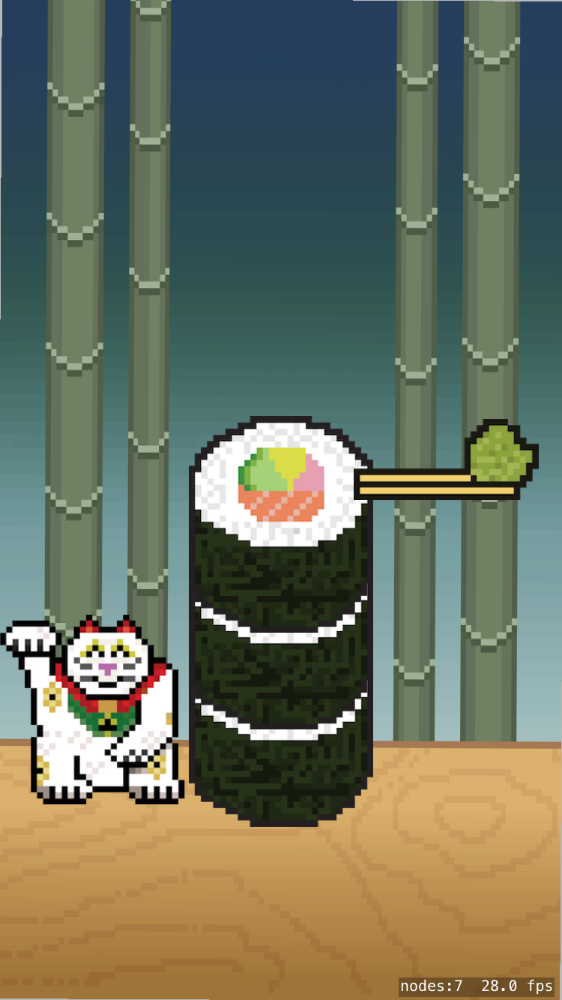
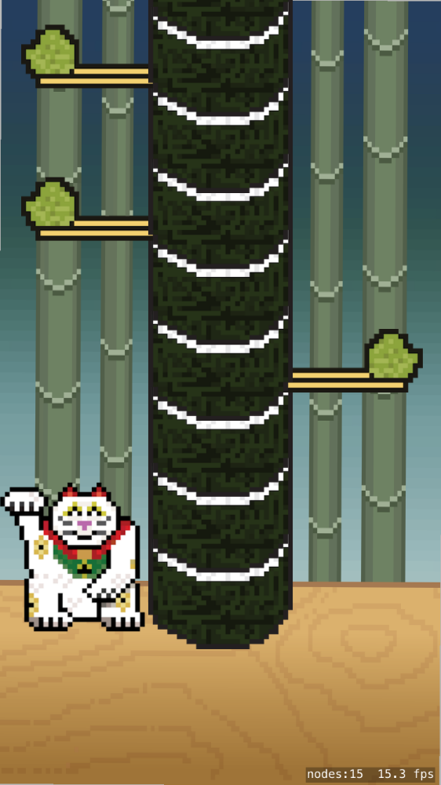

The *Sushi Tower* is at the heart of your game, you will be dynamically generating an infinite tower. You will use an
array of *SushiPieces* to form this tower, initially you will create just enough pieces to be tall enough to cover
the screen, there is no need to generate thousands of pieces :]  

Every time the cat punches a piece out of existence, you will then add a new piece to the top of the array, to create
the endless cycle of the sushi tower.

## Building the tower

The tower is simply an array of *SushiPiece* objects.

> [action]
> Open *GameScene.swift* and add the following property to the class:
>
```
/* Sushi tower array */
var sushiTower: [SushiPiece] = []
```
>

## Adding sushi to the tower

You are going to be adding lots of sushi, so it would be nice to add a method to perform this repetitive task.

> [action]
> Add the following method to the *GameScene* class.
>
```
func addTowerPiece(side: Side) {
   /* Add a new sushi piece to the sushi tower */
>   
   /* Copy original sushi piece */
   let newPiece = sushiBasePiece.copy() as! SushiPiece
   newPiece.connectChopsticks()
>   
   /* Access last piece properties */
   let lastPiece = sushiTower.last
>   
   /* Add on top of last piece, default on first piece */
   let lastPosition = lastPiece?.position ?? sushiBasePiece.position
   newPiece.position.x = lastPosition.x
   newPiece.position.y = lastPosition.y + 55
>   
   /* Increment Z to ensure it's on top of the last piece, default on first piece*/
   let lastZPosition = lastPiece?.zPosition ?? sushiBasePiece.zPosition
   newPiece.zPosition = lastZPosition + 1
>   
   /* Set side */
   newPiece.side = side
>   
   /* Add sushi to scene */
   addChild(newPiece)
>   
   /* Add sushi piece to the sushi tower */
   sushiTower.append(newPiece)
}
```
>

Have a read through the comments first...

The first step is to copy the original **sushiBasePiece**, we could have created this as a seperate *SKS* file however
given the frequent usage, performance will be better simply copying it. To be able to copy an object it must conform to the
[NSCopying](https://developer.apple.com/library/mac/documentation/Cocoa/Reference/Foundation/Protocols/NSCopying_Protocol/)
protocol. *SKSpriteNode* is a subclass of *SKNode* which conforms and implements the *NSCopying* protocol.

You want to stack each piece of sushi on top of the previous one. There is one exception, the very first piece to be
added to the tower will not have a previous piece in the tower.  In this case you effectively use **sushiBasePiece** as the
first piece.

Why increment the *Z Position*? Well to maintain that isometric look of the sushi you always want the top of the most recent
piece to be visible.

When you set the type of sushi via the *side* property the *didSet* observer in *SushiPiece* will show the correct
chopstick.

The *newPiece* is then added to the scene and also added to the *sushiTower* array with `append`.

## Seeding the tower

Before you move on top random generation, it would be a good idea to test this works and stack the tower with a couple of
starting pieces. This way you can always guarantee the cat starts in a safe position.

> [action]
> Add the following to the end of `didMove(to view:)`
>
```
/* Manually stack the start of the tower */
addTowerPiece(side: .none)
addTowerPiece(side: .right)
```
>

Run the game... You should hopefully see the start of your tower with the pieces you added manually.



Time to stack the sushi and create that random element.

# Random sushi generator

If you added the sushi using a true RNG (Random Number Generator) with a value of `.none, .left, .right`, it would most
likely become problematic very quickly. If you create a `.left` piece followed by a `.right` piece, there is nowhere for
the cat to go and death will be unavoidable. Which isn't much fun for the player.

You want to create a Fun-RNG, take a RNG and add some logic on to make the output fun and appropriate for your game.

> [action]
> Add this method to the *GameScene* class:
>
```
func addRandomPieces(total: Int) {
  /* Add random sushi pieces to the sushi tower */
>
  for _ in 1...total {
>  
      /* Need to access last piece properties */
      let lastPiece = sushiTower.last as! SushiPiece
>      
      /* Need to ensure we don't create impossible sushi structures */
      if lastPiece.side != .none {
         addTowerPiece(side: .none)
      } else {
>      
         /* Random Number Generator */
         let rand = arc4random_uniform(100)
>          
         if rand < 45 {
            /* 45% Chance of a left piece */
            addTowerPiece(side: .left)
         } else if rand < 90 {
            /* 45% Chance of a right piece */
            addTowerPiece(side: .right)
         } else {
            /* 10% Chance of an empty piece */
            addTowerPiece(side: .none)
         }
      }
  }
}
```
>

It's handy to be able to specify the number of pieces to add at one time, again you need access to the last sushi
piece added as it will help you make a decision on what piece should go next. Remember that you seeded the stack with a few
manual pieces so there will always be some sushi in the tower.

The `arc4random_uniform(n)` returns a random number from `0` to `n - 1`. Our logic above looks at the value returned and
generates sushi piece with chopsticks on the left if the number is less than (`<`) 45, if the number is 45 or greater and
less than 90 it generates a piece with the chopsticks on the right, if the number is 90 or greater the piece has no
chopsticks.

## Stocking the sushi tower

Why don't you try out this method and add `10` new sushi pieces to the tower.

> [solution]
> Add the following code to the end of `didMove(to view:)`
>
```
/* Randomize tower to just outside of the screen */
addRandomPieces(total: 10)
```
>

Run the game, it should look something like this, just slightly different :]



# Summary

You're making real progress, the sushi tower is the heart of this game mechanic.  

You've learnt to

- Dynamically generate sushi pieces and manage them in an array.  

Next up, bringing the cat to life.
