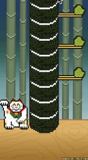
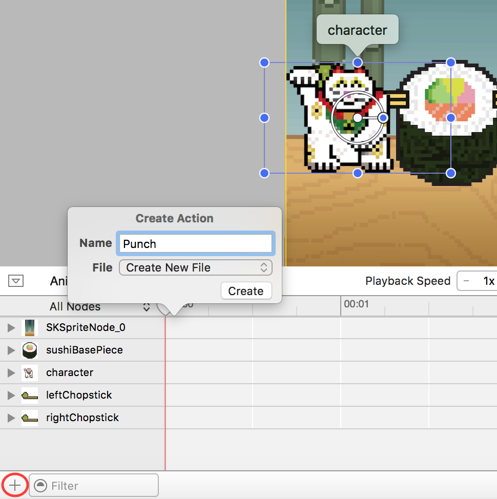
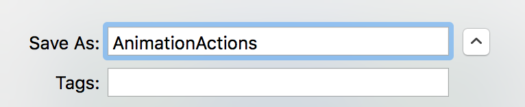
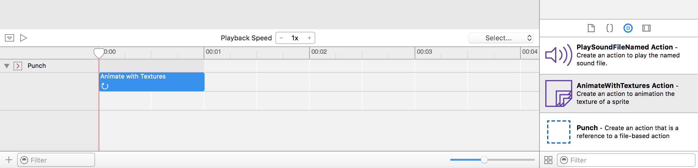
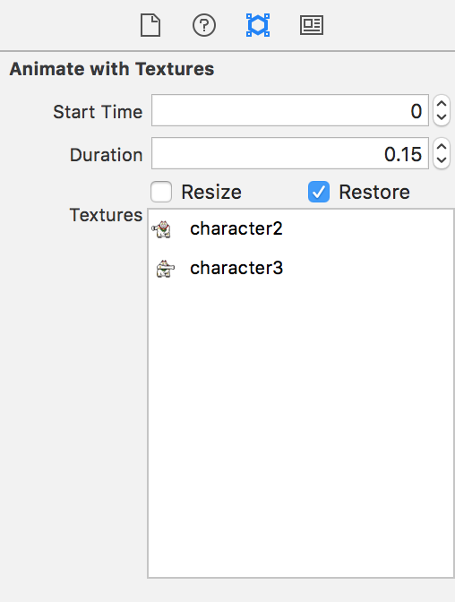
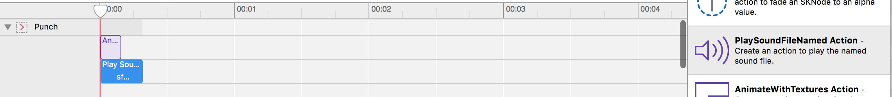
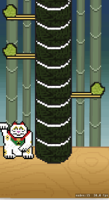
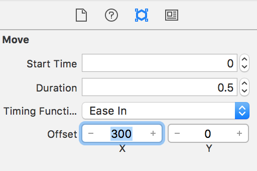
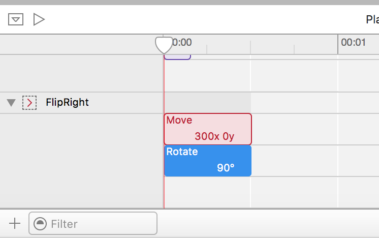
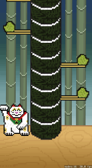

Time to work on the games core mechanic, it's a lesser known fact that cat's will punch sushi as all they want is some
sashimi.  Cats can also navigate space and time to teleport instantly from one side of the screen to the other and knock
those sushi clean out of the sushi tower.

You will be adding a simple touch mechanic to the game, if the player touches anywhere on the left/right hand side of the
screen, the cat will be moved to the left/right side and then punch the first piece of sushi in the sushi tower.

## Touch control

> [action]
> Add the method: `touchesBegan(_ touches:)`. Inside the `GameScene` class start typing "touchesB" and Xcode will 
> provide code hints, use this to help avoid mistakes. 
> 
```
override func touchesBegan(_ touches: Set<UITouch>, with event: UIEvent?) {
    
}
```
>
> Inside this method add the following: 
>
```
override func touchesBegan(_ touches: Set<UITouch>, with event: UIEvent?) {
    /* Called when a touch begins */
>    
    /* We only need a single touch here */
    let touch = touches.first!
>    
    /* Get touch position in scene */
    let location = touch.location(in: self)
>    
    /* Was touch on left/right hand side of screen? */
    if location.x > size.width / 2 {
        character.side = .right
    } else {
        character.side = .left
    }
}
```
>

You are performing a simple check to decide which side of the screen was touched. Remember the property observer *didSet*,
that you setup in *Character.swift* (Take a quick look)? When you set the *side* property the cat will move set its position
appropriately.

Run the game... You should have a working cat teleporter.



# Cat knockout

Great, your cat can move, how about that punch?

You are going to create three animation actions to enable your cat to perform this feat.

- A frame animation sequence for the cat punch
- A rotation/move sequence for the sushi in both left/right flavors

## One Punch animation

> [action]
> Open *GameScene.sks* and click on create new action in the timeline and name it `Punch`:
> 
>
> Save this new SpriteKit Action file as `AnimationActions.sks`
> 
>

This will open up the empty *AnimationActions.sks*, and you should have an empty **Punch** action in the timeline.

> [action]
> Expand then **Punch** action timeline, click on the *Object library* and drag across an *AnimateWithTextures Action*.
> 
>
> To build the animation you need to drag in the *character2.png* and *character3.png* from the *Media Library* into the
> *Textures* box of the new action.
> Set the *duration* to `0.15` as a punch should be snappy and **tick** `Restore`, this ensures when the punch is complete
> the cat will go back to it's default stance.
>
> 
>

## Adding sound to the timeline

Let's enhance the punch with a swipe sound effect.  You can tie this into the punch animation by adding a sound action to the timeline.

> [action]
> Drag the *PlaySoundFileNamed* action across to the `Punch` timeline, add it at `0` below the *Animate With Textures* action. Set the *Filename* to `sfx_swipe`.
> 
>


## Applying the action

You will run this custom **Punch** action whenever the *side* is set for the cat.

> [action]
> Open *Character.swift*, add the following inside the *didSet* observer after the `if/else` statement block.
>
```
/* Load/Run the punch action */
let punch = SKAction(named: "Punch")!
run(punch)
```
>

Run the game. Your cat should be able to punch now!



# Sushi tower

Looking good, next you will need to manage the sushi stack in response to a punch, this will involve:

- Removing the punched sushi from the sushi tower
- Adding a new random sushi to the top of the tower
- Animating the sushi being knocked out of the tower

Let's tackle removing and adding sushi before applying the visual polish.

> [action]
> Open *GameScene.swift* and add the following code inside `touchBegan(_ touches:)` immediately after the **if/else** statement
> block.
>
```
/* Remove from sushi tower array */
sushiTower.removeFirst()
>
/* Add a new sushi piece to the top of the sushi tower*/
addRandomPieces(1)
```
>

Run the game.... Well nothing much happens, this is because you are managing the sushi tower array correctly.  However, you
are not removing the sushi visually from the scene.  

## Improving the cycle

> [action]
> Replace this code block with:
>
```
/* Grab sushi piece on top of the base sushi piece, it will always be 'first' */
if let firstPiece = sushiTower.first as SushiPiece! {
    /* Remove from sushi tower array */
    sushiTower.removeFirst()
    firstPiece.removeFromParent()
    
    /* Add a new sushi piece to the top of the sushi tower */
    addRandomPieces(total: 1)
}
```
>

Run the game... You can see the sushi being removed from the sushi tower.  Great, yet not quite what you want, would be
better if the remaining sushi would drop down a position. Let's add this.

## Moving the tower

To move the tower down you'll loop through the array of shushi pieces and move each piece to a y position of it's position
in the array times `55` which is the height of the piece. Instead of moving directly to this position you'll figure the 
distance to move and move 50% of the distance. if we do this each frame, if the distance was 100 pixels, the piece would 
move 50 on the first update, 25 on the next, then 12.5, 6.25, 3.125, etc.  

> [action]
> Add a new method to `GameScene` to handle moving the tower down.
```
func moveTowerDown() {
    var n: CGFloat = 0
    for piece in sushiTower {
        let y = (n * 55) + 200
        piece.position.y -= (piece.position.y - y) * 0.5
        n += 1
    }
}
```
>

You'll use the scene's `update(_ currentTime:)` method to move the pieces down. This method is called 60 times per second. 
It's used for animating and updating game objects (`SKSpriteNodes` mostly) on the screen. If we call `moveTowerDown()`
with `update(_ currentTime:)` the sushi tower will always move down as pieces are removed. 

> [action] 
> Add `update(_ currentTime:)` inside `GameScene` start typing "update" wait for Xcode to show the method you want
> in the code hints. Then choose it and add `moveTowerDown()`. 
>
```
override func update(_ currentTime: TimeInterval) {
    moveTowerDown()
}
```
>

---
> [action]
> Add the following code after the last block:
>
```
/* Drop all the sushi pieces down one place */
for sushiPiece in sushiTower {
   sushiPiece.run(SKAction.move(by: CGVector(dx: 0, dy: -55), duration: 0.10))
>    
   /* Reduce zPosition to stop zPosition climbing over UI */
   sushiPiece.zPosition -= 1
}
```
>
---

Run the game... Should look a lot better now.

You're applying a *moveBy* action to move every piece of sushi in the sushi tower down by `55` pixels. You're also
decreasing the *Z-Position* of each piece.  If you recall every time a new piece is added the *Z-Position* is incremented,
the problem here is as the position climbs it will eventually become higher than other visual elements such as our UI.  
This way you keep the *Z-Position* of all the pieces in a manageable range.

#Animating the sushi

Time for you to add a bit of polish and create two new action animations.

> [action]
> Open *AnimationActions.sks* and create a new action called `FlipRight`.
> Expand the timeline for this action and drag across a *Move Action*
> Set the *Duration* to `0.5`, *Timing function* to `Ease In` and *Offset X* to `300`.
>
> 
>
> Now drag across a *Rotate Action* and place it directly under the *Move Action*.
> Set the *Duration* to `0.5`
>
> 

Great, you will need a FlipLeft action as well, it is possible to *Duplicate* an action.  However, there is no way to
rename it which isn't so great.

> [action]
> Create a new action called `FlipLeft`
> Copy the two actions from **FlipRight** into the **FlipLeft** timeline.
> Modify the *Offset X* of the *Move Action* to `-300`

Now you have two actions ready to be run in your game code. You will create a new method in *SushiPiece.swift* to
facilitate this.

> [action]
> Open *SushiPiece.swift* and add the following method to the class:
>
```
func flip(_ side: Side) {
   /* Flip the sushi out of the screen */
>   
   var actionName: String = ""
>   
   if side == .left {
      actionName = "FlipRight"
   } else if side == .right {
      actionName = "FlipLeft"
   }
>   
   /* Load appropriate action */
   let flip = SKAction(named: actionName)!
>   
   /* Create a node removal action */
   let remove = SKAction.removeFromParent()
>   
   /* Build sequence, flip then remove from scene */
   let sequence = SKAction.sequence([flip,remove])
   run(sequence)
}
```
>

Read through the comments, most of this should already be familiar to you.  You may not have seen the last section of code
in which you build a *SKAction.sequence*, which is simply joining actions together.  In this case when the **Flip**
animation is complete you want the sushi to be removed from the game.  Currently in the code you are calling
*removeFromParent()* to instantly remove the sushi, so the player will never see the anination.

> [action]
> Open *GameScene.swift* and replace the following inside `touchesBegan(...)`
>
```
firstPiece.removeFromParent()
```
>
> with
>
```
/* Animate the punched sushi piece */
firstPiece.flip(character.side)
```
>

Now run the game.... Flying sushi!



#Summary

Great job, you've achieved a lot in this chapter, the game's core mechanic is now in place.  You've learnt to:

- Add touch controls
- Build animations visually
- Run animation sequences in code
- Manage an array

Next it's time to turn this core game mechanic into an actual game.
