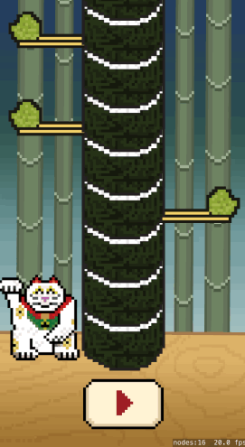

What is the difference between a game mechanic and a game? You've built the core game mechanic yet on its own this is not very satisfying for the player.  You need to wrap it up now into a game, the best advice is always, keep it simple!

- What is the challenge for the player?
- How can you show the player progression?
- What UI elements are needed?
- Tracking the gamestate

##The challenge

How to challenge the player? You will be adding a health bar that will progressively decrease as time goes on.  The player can refresh their health with every successful sushi piece knockout.

##The progression

The classic indicator of progression is to introduce a scoring element.  You will add a score counter for every sushi piece knocked out.

##The User Interface

Let's keep it simple to start with and add a Play button that will also serve as the restart button upon the player's death.

#GameState management

As it stands we have no idea what state the game is in, before we introduce additional elements we need to know what
state the game is in.  Are we waiting for the player to press play? Is the game in progress? Did the player just die?

Previously you used an *Enumeration* type to define the possible *side* states for the cat and sushi.

> [action]
> Add the following code to the top of *GameScene.swift*
>
```
/* Tracking enum for game state */
enum GameState {
    case title, ready, playing, gameOver
}
```
>

You will need to implement a tracking property to the GameScene class, let's default it to `.title` as you would expect
this to be first state the player experiences after opening the game.

> [action]
> Add the following property to the *GameScene* class.
>
```
/* Game management */
var state: GameState = .title
```
>

##Play button

When should you change the GameState change from `.title` to `.ready`? Let's add a play button.

> [action]
> Open *GameScene.sks* and drag *button.png* to the bottom-middle of the scene, just below the sushi base.
> Set *Name* to `playButton`, change *Custom Class* to `MSButtonNode`.

<!-- -->

> [info]
> SpriteKit does not come with an easy way to make buttons so we created a basic button class called *MSButtonNode* for you.
> Feel free to explore this class if you've not comes across it before, it's in the **Utils** folder in the *Project Navigator*.  The *MSButtonNode* class is explored in greater detail in the *Hoppy Bunny Tutorial*
>

Next you need to code connect the *playButton* to the **GameScene** class, see if you can do this yourself.

> [solution]
> Open *GameScene.swift* and add following property to the class:
>
```
var playButton: MSButtonNode!
```

> Next create the connection in `didMoveToView(...)`
>
```
/* UI game objects */
playButton = childNodeWithName("playButton") as! MSButtonNode
```
>

Now the button is connected you need to add some code to execute when the button is touched.

> [action]
> Add the following code to `didMoveToView(...)`
>
```
/* Setup play button selection handler */
playButton.selectedHandler = {
>
    /* Start game */
    self.state = .ready
}
```
>

Great, now you are changing the game state state, yet on it's own it doesn't mean much.  You need to use the game state
to enable/disable various elements of the game.  You don't want the cat to be able to move until the game is in a
`.ready` state.

##Disabling touch

> [action]
> Add the following code to the top of `touchesBegan(...)`:
>
```
/* Game not ready to play */
if state == .gameOver || state == .title { return }
/* Game begins on first touch */
if state == .ready {
   state = .playing
}
```
>

You want to disable touch when the player is not `.Playing`, the first line covers this by simply returning from the
method when the player is on the title screen or dead.

The next line adds a little nuance, when the player press the button the game changes to a `.Ready` state.  However,
we don't want the game to begin until that first screen touch by the player.

Run the game... Hopefully you can't control the cat until you've hit the play button first :]

#Game Over

You added a `.gameOver` state, so let's look at the ways the player can die:

- The player gets hit by a chopstick
- The player runs out of health

##Death by chopstick

If the player doesn't dodge the chopsticks they should die, there is no need for any advanced collision detection.  
You will want to check the *side* of the first piece of sushi against the *side* of the cat.  If they are the same then
the player has been hit and Game over.

> [action]
> Add the following code in `touchesBegan(...)` after setting character.side:
>
```
/* Grab sushi piece on top of the base sushi piece, it will always be 'first' */
let firstPiece = sushiTower.first as SushiPiece!
```
> Add this
```
/* Check character side against sushi piece side (this is our death collision check)*/
if character.side == firstPiece?.side {
>        
    /* Drop all the sushi pieces down a place (visually) */
    for sushiPiece in sushiTower {
        sushiPiece.run(SKAction.move(by: CGVector(dx: 0, dy: -55), duration: 0.10))
    }
>        
    gameOver()
>        
    /* No need to continue as player dead */
    return
}
```
>

That was a cheap and easy collision check, you may have noticed the visual sushi tower drop code is being used in the
same method twice.

> [challenge]
> Why don't you refactor this code into a new method?

##Adding the gameover method

Now you need to add a *gameOver* method, you will want to:

- Set the gameState to `.GameOver`.
- Provide a way for the player to restart the game
- Be nice to add some visual indicator of death

> [action]
> Add this new method to the *GameScene* class:
>
```
func gameOver() {
    /* Game over! */
>    
    state = .gameOver
>    
    /* Turn all the sushi pieces red*/
    for sushiPiece in sushiTower {
        sushiPiece.run(SKAction.colorize(with: UIColor.red, colorBlendFactor: 1.0, duration: 0.50))
    }
>    
    /* Make the player turn red */
    character.run(SKAction.colorize(with: UIColor.red, colorBlendFactor: 1.0, duration: 0.50))
>    
    /* Change play button selection handler */
    playButton.selectedHandler = {
>        
        /* Grab reference to the SpriteKit view */
        let skView = self.view as SKView!
>        
        /* Load Game scene */
        let scene = GameScene(fileNamed:"GameScene") as GameScene!
>        
        /* Ensure correct aspect mode */
        scene?.scaleMode = .aspectFill
>        
        /* Restart GameScene */
        skView?.presentScene(scene)
    }
}
```
>

Read through the comments, most of this should be familiar. For a visual effect you're using the
*SKAction.colorizeWithColor* to turn the tower and cat red.

> [challenge]
> Have some fun with the game over sequence :]

Run the game... It should look like this.



#Summary

Great progress, you now have a functional game!

You've learnt to:

- Manage your game through use of gamestates
- Add basic UI
- Implement code based collision detection

In the next chapter, let's expand upon the gameplay with the health and score mechanics.
