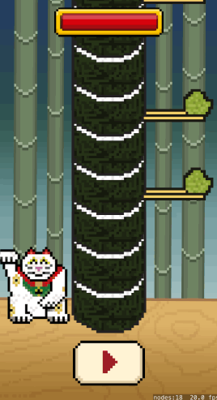
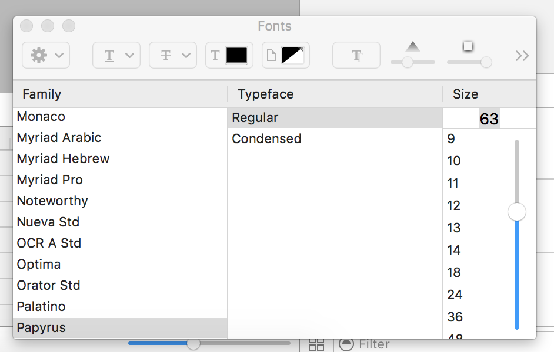
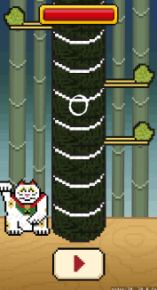

Let's expand upon your gameplay with the a health mechanic to add time pressure to the players actions and of course the quintessential indicator of success, the score label!

#Adding the health bar

The health bar comprises of two assets, the *life_bg.png* background and the *life.png* health bar.

> [action]
> Open *GameScene.sks* and drag *life_bg.png* to the center of the scene and near the top.
> Set the *Z Position* to `100`, you want this to be high due to the sushi pieces.
> Drag *life.png* into the center of the the bar, set the *Z-Position* to `101` and *Name* to `healthBar`
>

How do you think you could gracefully decrease the health bar?

##Scaling the bar

There is a really nice way to create the effect of a bar gradually decreasing in size.  You can scale it.  However, if you
try to scale it right now in the scene editor it will scale in a uniform manner, decreasing in size on all sides.  This is due to the *Anchor Point* being set to `(0.5,0.5)`.

> [action]
> Change the *Anchor Point* of the *healthBar* to the bottom-left `(0,0)`, you may have to reposition it back into place after you do this.
> Now setting *Scale X* to `0.5`, looks good :], Set it back to `1.0` when finished.
>

You now know how to scale the *healthBar* between `0` and `1` to achieve the desired effect.

Can you code connect the *healthBar*?

> [solution]
> Add the following property to the *GameScene* class
>
```
var healthBar: SKSpriteNode!
```
>
> Next, add this code to `didMoveToView(...)`
>
```
healthBar = childNodeWithName("healthBar") as! SKSpriteNode
```
>

Great you now have access to the *healthBar* object.  However, you will want to use another property to track the players health and use this value to update the bar visually.

##Health counter

Let's add a *CGFloat* type property called `health` and make use again of the *didSet* property observer to reflect any changes into the *healthBar*.

> [action]
> Add this property:
>
```
var health: CGFloat = 1.0 {
  didSet {    
      /* Scale health bar between 0.0 -> 1.0 e.g 0 -> 100% */
      healthBar.xScale = health
  }
}
```
>

Nice, now where do you think the player should gain health and where should they lose health?
You want the player to feel pressured by time, the longer they take to act the more health they lose.  When they do act they should gain health.  The trick is getting the balance right between loss and gain, something you can tweak yourself from player feedback :]

A great place to add a steady decline would be in the `update(..)` method.

> [action]
> Replace the existing `update(...)` method with:
>
```
override func update(currentTime: CFTimeInterval) {
  /* Called before each frame is rendered */
  if state != .Playing { return }
>
  /* Decrease Health */
  health -= 0.01
>
  /* Has the player ran out of health? */
  if health < 0 { gameOver() }
}
```
>

This is also a great place to check for the other type of player death due to lack of health.  Again you don't want this to be active until the game is in play.

Run the game... The health bar should tick down and you eventually die and there is nothing you can do about it :[

##Adding health

To counter balance this decline you should give the player health every time they successfully punch the sushi.

> [action]
> After the collision check in `touchesBegan(...)` add:
>
```
/* Increment Health */
health += 0.1
```
>

Run the game...



The player's health goes up, yet there is a small problem here.  The health bar can now exceed 100%!

Can you rectify this in the *health* property observer?

> [solution]
> Add this to the start of the *didSet* observer in the *health* property:
>
```
/* Cap Health */
if health > 1.0 { health = 1.0 }
```
>

Run the game again... Excellent

#Adding the score

Adding the score is very similar to adding health.  You will need to add a *SKLabel* to the *GameScene* to display the player's score in the scene and also a counter property to track the score and use this value to refresh the label.

> [action]
> Open *GameScene.sks* and drag across a *Label* from the *Object Library*, if you're having problems selecting the label to move it once it's in the scene.  You can also use the **Arrow Keys**, **Hold Shift** to move it in larger steps. You can of course set the *Position* to something like `(160,340)`
> Set the *Name* to `scoreLabel` and change the *Font* to something you like.
> 
> Set the *Text* to `0` and set the *Z-Position* to `100`
>


Next code connect the *scoreLabel*, see if you can do this one yourself.

> [solution]
> Add a new property to the *GameScene* class:
>
```
var scoreLabel: SKLabelNode!
```
> Then connect it in `didMoveToView(...)`:
>
```
scoreLabel = childNodeWithName("scoreLabel") as! SKLabelNode
```
>

Now that you have access to the label, you will want to add a score counter that can be used to track the player's score and then update the *scoreLabel*.

> [action]
> Add the following property to the *GameScene* class:
>
```
var score: Int = 0 {
  didSet {
    scoreLabel.text = String(score)
  }
}
```
>

When the score value changes the *text* property of the *scoreLabel* is updated to the new value.

Time to give the player some points.

> [action]
> Add the following code after:
>
```
/* Increment Health */
health += 0.1
```
>
```
/* Increment Score */
score += 1
```
>

Run the game...  Congratulations, you should now have a fully functional game!



#Summary

Congratulations you've completed *Sushi Neko*, give the person next to you a high five.

You learnt to:
- Add health and score mechanics
- Implement game counters and utilize property observation to update the display objects.

The next chapter will be a recap of everything you have covered so far, well done.
