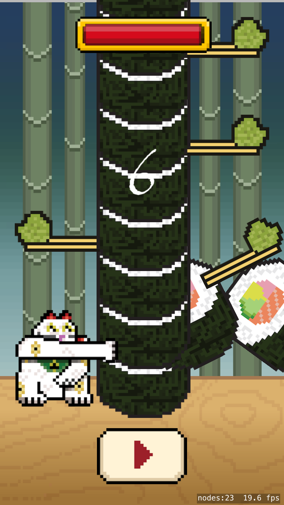

Congrats again on finishing *Sushi Neko* and building another great iPhone game!

Let's take a look at what you have learned.

##Core game objects

- **Subclassing**: Subclassing *SKSpriteNode* to create custom game object classes, to implement specific functionality.

- **Enumeration**: Using enumeration to facilitate game object state tracking.

- **Property Observation**: Using *didSet* property observation to monitor property changes and apply relevant changes such as changing character position or modifying scale.

- **Multi part object**: Creating more complex game objects out of multiple sprites.

##The Sushi Tower

- **Dynamic Tower**: Learn to utilize a RNG and apply rules to dynamically generate sushi object to fill the sushi tower block.

##Core Mechanic

- **Game state management**: Managing the game state through the game lifecycle from first play to death and back again.

- **User Interface**: Adding a basic user interface for the player.

- **Collision detection**: Learning how to build alternative code based collision detection, no need for physics collision detection here.

- **Array management**: Managing an array, adding new pieces to the top of the array and removing the first piece in the array.

##Turning a mechanic into a game

- **Health & Score**: Adding health and score mechanics, using game counters and using property observation to reflect these counters visually.

# Solution

[Download Sushi Neko](https://github.com/MakeSchool-Tutorials/Sushi-Neko-SpriteKit-Swift-Solution/tree/swift3).

## Bonus stage

If you've made it this far you're ready to face the **bonus stage**, although this content is optional.  I would highly recommend it as it will generate ideas for your own game and give you some essential practical experience.  The challenges are designed to help you round off your game.
